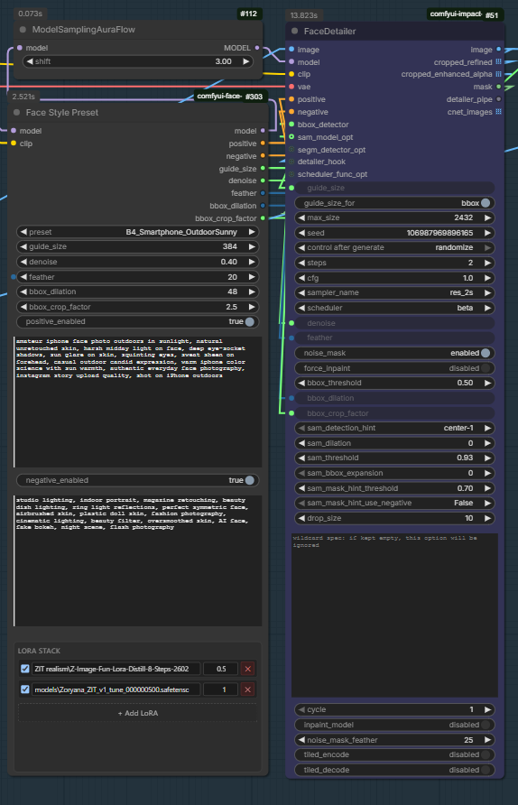

# ComfyUI Face Style Preset (for FaceDetailer)

All-in-one face styling node for ComfyUI's FaceDetailer (Impact Pack).
One node replaces a LoRA loader, two CLIPTextEncode nodes, and the parameter
setter that normally feeds FaceDetailer.

- 🎨 **12 curated style presets** — Magazine, Smartphone (5 variants), Vintage
  Film, Cinematic Noir, Fashion Editorial, Boudoir, plus `User_Manual` and
  `None` modes
- ⚡ **Live auto-fill** — pick a preset and positive / negative prompts and
  face parameters snap into the widgets
- 🧬 **Dynamic LoRA stack** — add / remove LoRA slots on the fly, with a
  searchable autocomplete dropdown
- 🔌 **CLIP encoding built in** — outputs `CONDITIONING` directly, no separate
  `CLIPTextEncode` needed
- 📐 **FaceDetailer-ready** — `guide_size`, `denoise`, `feather`,
  `bbox_dilation`, `bbox_crop_factor` outputs wire straight into Impact
  Pack's FaceDetailer
- ✏️ **Everything editable** — preset values are starting points, every
  widget remains independently adjustable
- 💾 **Workflow-safe** — LoRA stack persists in saved workflows via a hidden
  JSON field

---

## Screenshot



A typical Z-Image Turbo workflow: `Face Style Preset` feeds modified `model`
through `ModelSamplingAuraFlow` into `FaceDetailer.model`, while its
`positive` / `negative` CONDITIONING and `guide_size` / `denoise` / `feather`
/ `bbox_dilation` / `bbox_crop_factor` numeric outputs wire straight into
the matching FaceDetailer inputs. The LoRA stack shown uses `B4_Smartphone_OutdoorSunny`
preset with a `Zoryana` character LoRA + a Z-Image Fun detail LoRA.

---

## Installation

### Option 1 — ComfyUI Manager (once published to the registry)

Search "Face Style Preset" in ComfyUI Manager → Install.

### Option 2 — Manual

```bash
cd <ComfyUI>/custom_nodes
git clone https://github.com/defrelender/comfyui-face-preset.git
```

Or download the ZIP and extract it to
`<ComfyUI>/custom_nodes/comfyui-face-preset/`.

Restart ComfyUI. The node appears under the **Face Tools** category.

No additional Python dependencies — uses only ComfyUI's own modules and the
standard library.

### Requirements

- ComfyUI (recent)
- Python ≥ 3.10
- [ComfyUI-Impact-Pack](https://github.com/ltdrdata/ComfyUI-Impact-Pack) for
  FaceDetailer (only if you want to wire the output parameters into it)

---

## Quick start

1. Add the node: right-click → **Add Node → Face Tools → Face Style Preset**.
2. Wire `MODEL` and `CLIP` from your checkpoint (or upstream LoRA loader) into
   the corresponding inputs.
3. Pick a preset from the dropdown — positive / negative texts and face
   parameters fill in automatically.
4. Optionally tweak any widget by hand. Your edits stick until you change
   the preset again.
5. Click **+ Add LoRA** to stack character / style / detail LoRAs. Type to
   filter the file list, set strength, toggle each on/off.
6. Wire outputs:
   - `model` → directly to `KSampler.model` and `FaceDetailer.model`
     for SD1.5 / SDXL / Flux, **or** through `ModelSamplingAuraFlow` /
     `ModelSamplingSD3` first for Z-Image Turbo / AuraFlow / SD3
   - `positive` / `negative` → `KSampler` and/or `FaceDetailer` CONDITIONING inputs
   - `guide_size` / `denoise` / `feather` / `bbox_dilation` /
     `bbox_crop_factor` → matching `FaceDetailer` parameters (right-click
     each widget on FaceDetailer → **Convert widget to input** to enable
     the connection)

---

## Presets

| Key | Label | guide_size | denoise | Use case |
|---|---|---:|---:|---|
| `User_Manual` | User Manual (custom) | 384 | 0.40 | Type your own — JS leaves widgets alone |
| `None` | None (empty) | 384 | 0.40 | Reset to empty / safe defaults |
| `A_Magazine_Cinematic` | Magazine / Cinematic | 512 | 0.47 | Glossy editorial |
| `B0_Smartphone_Default` | Smartphone default | 384 | 0.38 | iPhone candid |
| `B1_Smartphone_YoungSelfie` | Young casual selfie | 384 | 0.38 | Friend snap |
| `B2_Smartphone_IndoorCasual` | Indoor casual | 384 | 0.38 | Warm tungsten room |
| `B3_Smartphone_NightOut` | Night out / club | 384 | 0.40 | Flash party photo |
| `B4_Smartphone_OutdoorSunny` | Outdoor sunny | 384 | 0.40 | Harsh midday sun |
| `B5_Smartphone_LowLight` | Low light dim | 384 | 0.40 | Candlelit / dim ambient |
| `B6_Smartphone_iPhone15Pro_Ultrawide` | iPhone 15 Pro ultrawide | 384 | 0.38 | Wide environmental portrait |
| `B7_Smartphone_JustWokeUp` | Just woke up | 384 | 0.38 | Sleepy morning bedroom |
| `B8_Smartphone_PostShower` | Post shower | 384 | 0.40 | Wet hair, dewy skin, steam |
| `B9_Smartphone_PreGoingOut` | Pre going out | 384 | 0.38 | Half-done makeup, vanity |
| `B10_Smartphone_TiredAfterWork` | Tired after work | 384 | 0.38 | Couch slump, dim lamp |
| `B11_Smartphone_LaughingCandid` | Laughing candid | 384 | 0.40 | Friend-caught mid-laugh |
| `B12_Smartphone_OnlyFans_AmateurNude` | OnlyFans creator | 384 | 0.40 | Ring light, curated bedroom |
| `B13_Smartphone_LingerieBedroom` | Lingerie bedroom | 384 | 0.40 | Sensual amateur self-shot |
| `B14_Smartphone_MirrorNudeSelfie` | Mirror nude selfie | 384 | 0.38 | Raw amateur full body |
| `B15_Smartphone_DiscordLeak` | Discord leak aesthetic | 384 | 0.42 | Webcam quality 720p |
| `B16_Smartphone_TikTokRingLight` | TikTok ring light | 384 | 0.38 | Content creator vertical |
| `B17_Smartphone_SnapchatGeofilter` | Snapchat snap | 384 | 0.38 | Ephemeral location snap |
| `C_Vintage_Film` | Vintage film | 448 | 0.42 | 35mm analog |
| `D_Cinematic_Noir` | Cinematic noir | 512 | 0.50 | Dramatic chiaroscuro |
| `E_Fashion_Editorial` | Fashion editorial | 512 | 0.48 | Vogue / Harper's |
| `F_Boudoir_Intimate` | Boudoir intimate | 448 | 0.42 | Soft warm romantic |

### Preset behaviour

| Preset | What auto-fill does |
|---|---|
| `User_Manual` | **Nothing.** JS does not touch widgets — full manual control. |
| `None` | Clears positive / negative text, sets safe defaults (384 / 0.4 / 20 / 32). |
| Any named preset | Populates all six widgets with the preset's values. Edits afterwards stick. |

---

## LoRA stack

The bottom of the node hosts a dynamic LoRA list — same idea as rgthree's
Power Lora Loader, scoped to face / style work.

- **+ Add LoRA** — appends an empty row
- **Filter** — click the LoRA name field and type any part of a filename to
  filter the autocomplete list
- **Toggle** — checkbox on the left enables / disables that slot without
  removing it
- **Strength** — numeric input, range `-10.0 … 10.0` (negative values invert
  the LoRA)
- **✕** — remove the row

Slots are applied in the listed order. Empty names, disabled toggles, and
strength `0.0` are skipped. Both MODEL and CLIP receive the same strength.

The list is stored as JSON in a hidden widget (`lora_stack_json`) so the
configuration is saved with the workflow.

If you load a workflow on a machine where a LoRA file is missing, the row
shows an orange border and tells you which file is missing — the LoRA is
silently skipped at runtime so the rest of the workflow still runs.

---

## Adding your own preset

Open `face_presets.json` next to the node and add an entry:

```json
"X_Cyberpunk_Neon": {
  "label": "X. Cyberpunk Neon",
  "description": "Neon-lit cyberpunk aesthetic.",
  "positive": "neon-lit cyberpunk portrait, vibrant magenta and cyan rim lights, ...",
  "negative": "daylight, natural light, soft palette, ...",
  "guide_size": 512,
  "denoise": 0.47,
  "feather": 20,
  "bbox_dilation": 32,
  "bbox_crop_factor": 3.0
}
```

Restart ComfyUI (or hard-refresh the page with `Ctrl+Shift+R`). The new
preset shows up in the dropdown and the JS auto-fill picks it up via the
`/face_style_preset/presets` server endpoint.

### JSON schema

Required fields per preset:

- `positive` — string (positive prompt text)
- `negative` — string (negative prompt text)
- `guide_size` — number, 64 … 2048
- `denoise` — number, 0.0 … 1.0
- `feather` — integer, 0 … 64
- `bbox_dilation` — integer, 0 … 256
- `bbox_crop_factor` — number, 1.0 … 10.0 (FaceDetailer default is 3.0)

Optional (documentation only — not consumed by the node):

- `label` — human-readable name
- `description` — short explanation

---

## How it works

```
                     ┌──────────────────────────┐
   MODEL ──────▶─────│  Face Style Preset       │
   CLIP  ──────▶─────│                          │
                     │  [ LoRA stack applied ]  │
                     │           ↓              │
                     │   modified MODEL + CLIP  │
                     │           ↓              │
                     │  encode positive prompt  │
                     │  encode negative prompt  │
                     └──┬───┬───┬────┬─────┬────┘
                        │   │   │    │     │
                        ▼   ▼   ▼    ▼     ▼
                      model pos neg  guide_size / denoise
                                     feather / bbox_dilation /
                                     bbox_crop_factor

  Typical downstream wiring:

    model      ──► (optional) ModelSamplingAuraFlow / ModelSamplingSD3
                       │
                       ├──► KSampler (main pass)
                       └──► FaceDetailer.model (face pass)

    positive   ──► KSampler.positive   AND/OR   FaceDetailer.positive
    negative   ──► KSampler.negative   AND/OR   FaceDetailer.negative

    guide_size, denoise, feather, bbox_dilation, bbox_crop_factor
               ──► FaceDetailer (right-click each widget on FaceDetailer
                                 → "Convert widget to input")

  Note: for Z-Image Turbo / AuraFlow / SD3 the modified MODEL must pass
  through the matching ModelSampling node before reaching KSampler or
  FaceDetailer. For SD1.5 / SDXL / Flux you usually wire the model output
  directly.
```

### Architecture notes

- The Python backend (`face_style_preset.py`) defines a single node
  registered as `FaceStylePreset` under the **Face Tools** category. It
  parses the JS-managed `lora_stack_json` widget, applies LoRAs via
  `comfy.sd.load_lora_for_models`, then runs `clip.encode_from_tokens` to
  produce CONDITIONING.
- The frontend extension (`web/face_style_preset.js`) hooks the `preset`
  widget callback for auto-fill, hides the JSON widget, and renders a
  custom DOM widget for the LoRA stack.
- Server routes registered in `__init__.py`:
  - `GET /face_style_preset/presets` — returns the contents of
    `face_presets.json`
  - `GET /face_style_preset/loras` — returns the list of LoRA filenames
    from ComfyUI's `loras` folder

---

## Compatibility

- Tested against modern ComfyUI builds with the standard `comfy.sd` API.
- Works with any model architecture where `clip.encode_from_tokens` returns
  `(cond, pooled)`. This covers SD1.5, SDXL (with caveats for two-CLIP
  encoders), Flux, Z-Image-Turbo, and most distilled / fine-tuned
  derivatives. If you hit an exotic CLIP variant, open an issue.
- LoRA loading uses ComfyUI's native loader — supports `.safetensors`,
  LoRA, LoCon, LoKr, LoHA, etc.

---

## Troubleshooting

**Node doesn't appear after install / update.** Delete the
`__pycache__` folder inside `comfyui-face-preset/` and restart ComfyUI.
Python bytecode caches can stick around when files are replaced.

**JS UI not loading (no LoRA stack widget).** Hard-refresh the browser
(`Ctrl+Shift+R`). The browser caches JS files aggressively.

**`guide_size` won't connect to FaceDetailer.** Make sure FaceDetailer's
matching widget is converted to an input (right-click → **Convert widget
to input**). The connector colour should be green (FLOAT) — this node
outputs FLOAT. If you see a colour mismatch with a third-party detailer,
it expects a different type and you may need a converter node.

**Preset auto-fill is silent.** Check the browser console (F12) for
`[FaceStylePreset]` log lines. The extension logs at setup how many
presets and LoRAs it loaded.

**LoRA file shows orange border.** That filename isn't in ComfyUI's
`loras` folder. Either fix the name or copy the file in. The LoRA is
silently skipped at runtime in this state.

---

## License

MIT — see [LICENSE](LICENSE).

## Acknowledgments

- [ComfyUI](https://github.com/comfyanonymous/ComfyUI) by comfyanonymous
- [ComfyUI-Impact-Pack](https://github.com/ltdrdata/ComfyUI-Impact-Pack) by
  ltdrdata — FaceDetailer reference implementation
- [rgthree-comfy](https://github.com/rgthree/rgthree-comfy) — Power Lora
  Loader inspired the dynamic LoRA UI pattern

## Changelog

### 2.2.0 — Amateur photography expansion (13 new presets)
- `B5_Smartphone_LowLight` — dim ambient amateur, ISO grain, single warm light
- `B6_Smartphone_iPhone15Pro_Ultrawide` — 0.5x ultrawide with barrel distortion
- `B7_Smartphone_JustWokeUp` — morning bed, sleepy bare face, pillow creases
- `B8_Smartphone_PostShower` — wet hair, dewy skin, steam, bathroom mirror
- `B9_Smartphone_PreGoingOut` — half-done makeup, vanity lights, anticipation
- `B10_Smartphone_TiredAfterWork` — couch slump, dim lamp, exhausted
- `B11_Smartphone_LaughingCandid` — friend-caught mid-laugh with motion blur
- `B12_Smartphone_OnlyFans_AmateurNude` — content creator with ring light catchlight
- `B13_Smartphone_LingerieBedroom` — amateur lingerie self-shot
- `B14_Smartphone_MirrorNudeSelfie` — raw full-body nude in mirror
- `B15_Smartphone_DiscordLeak` — webcam quality 720p leaked screenshot vibe
- `B16_Smartphone_TikTokRingLight` — TikTok creator with subtle beauty filter
- `B17_Smartphone_SnapchatGeofilter` — Snapchat snap aesthetic with filter

Total preset count: 25 (was 12).

### 2.1.0 — Match FaceDetailer parameter names
- Renamed output `bbox_padding` → `bbox_dilation` (matches Impact Pack's
  `FaceDetailer.bbox_dilation` parameter exactly)
- Added new output `bbox_crop_factor` (FLOAT) → wires straight into
  `FaceDetailer.bbox_crop_factor`. Controls how much area around the
  detected face bbox is cropped for the detail pass.
- Per-style defaults for `bbox_crop_factor`:
  - Magazine / Fashion / Boudoir → 3.5 (more context for refined work)
  - Smartphone variants / Vintage Film → 2.5 (tighter, candid)
  - Noir / User_Manual / None → 3.0 (FaceDetailer default)

### 2.0.0 — All-in-one rework
- One unified node replacing the previous two (`FaceStylePreset` +
  `FaceStylePresetWithOverride`)
- Built-in CLIP encoding → outputs `CONDITIONING` directly
- Dynamic LoRA stack with add / remove and searchable autocomplete
- `MODEL` / `CLIP` inputs threaded through LoRAs
- Hidden `lora_stack_json` widget persists the stack inside saved workflows
- Server endpoint `/face_style_preset/loras` for the LoRA file list
- `guide_size` is now FLOAT to match Impact Pack's FaceDetailer signature
- Added `User_Manual` and `None` presets

### 1.0.0 — Initial release
- Two preset nodes (basic + with override) outputting plain text and
  numeric values
- 10 curated face style presets
